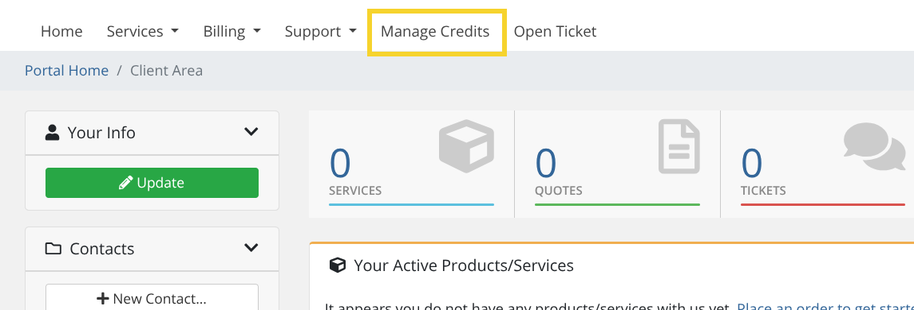
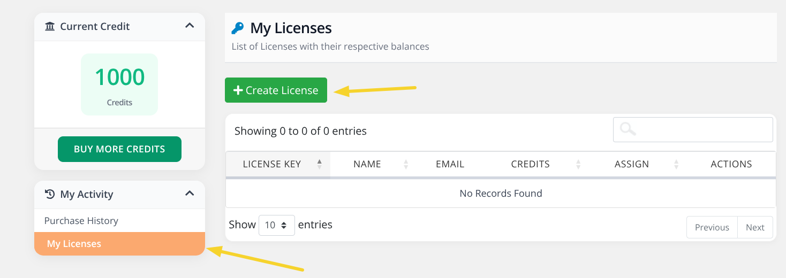
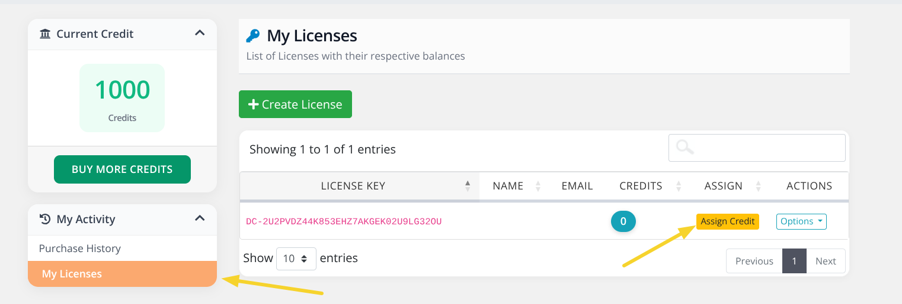
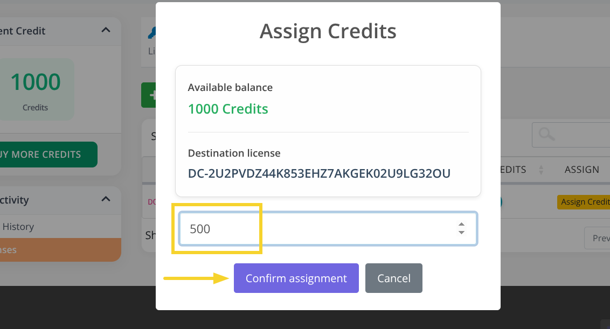
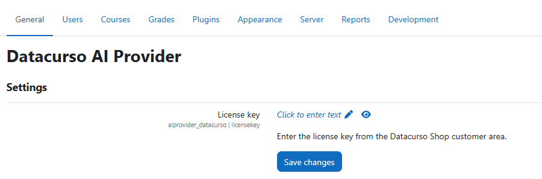

# Datacurso AI Provider for Moodle

The **Datacurso AI Provider** is the core engine that connects Moodle with the **Datacurso AI services** — unlocking a full ecosystem of smart, AI-powered plugins designed to revolutionize online learning.

This provider serves as the central bridge that powers every Datacurso AI extension, enabling a new generation of intelligent features for teachers, students, and administrators.

In addition, the **Datacurso AI Provider** includes built-in capabilities to display **detailed token usage reports** directly within Moodle.  
Administrators can easily monitor and manage AI service consumption through visual dashboards showing:

- **Number of tokens consumed per month**
- **Available tokens**
- **Total tokens consumed**
- **Token distribution by service**
- **Daily token usage trends**

## The Datacurso AI Plugin Suite

Transform Moodle into a **smarter, faster, and more engaging learning platform** with the **Datacurso AI Plugin Suite** — a collection of next-generation tools that bring artificial intelligence directly into your LMS.  
All plugins in this suite are powered by the **Datacurso AI Provider**.

### Explore the Suite

- **[Ranking Activities AI](#)**
  Empower students to rate course activities while AI analyzes feedback and provides deep insights to educators.

- **[Forum AI](#)**  
  Introduce an AI assistant into your forums that contributes to discussions and keeps engagement alive.

- **[Assign AI](#)**  
  Let AI review student submissions, suggest feedback, and support teachers in the grading process.

- **[Tutor AI](#)**  
  Offer students a personal AI tutor that answers questions, explains concepts, and guides them through their learning path.

- **[Share Certificate AI](#)**  
  Celebrate achievements automatically! AI generates personalized social media posts when students earn certificates.

- **[Student Life Story AI](#)**  
  Gain a complete view of student performance with AI-generated summaries across all enrolled courses.

- **[Course Creation AI](#)**  
  Build full Moodle courses in minutes — complete with lessons, activities, and resources — guided by AI.

- **[Activity Creation AI](#)**  
  Design engaging, high-quality learning activities instantly using AI-generated suggestions and templates.

## Powering Moodle’s Built-In AI Features

Beyond the Datacurso suite, the **AI Provider** also enables Moodle’s **native AI features**, enhancing creativity and productivity across your entire platform:

- **Generate Text** – Create meaningful content from any prompt.  
- **Generate Image** – Produce original images from text descriptions.  
- **Summarize Text** – Quickly generate concise summaries from course content.

## Pre-requisites

1. Tener minimo la version 4.5 de moodle
2. Adquirir un paquete de creditos de AI desde el [shop de DataCurso](https://shop.datacurso.com/index.php?m=tokens_manager) y crear una llave de licencia tal como se indica en la seccion [Obtener llaves de licencia](#obtener-llaves-de-licencia)

## Installing via uploaded ZIP file

1. Log in to your Moodle site as an admin and go to `Site administration > Plugins > Install plugins`.
2. Upload the ZIP file with the plugin code. You should only be prompted to add
   extra details if your plugin type is not automatically detected.
3. Check the plugin validation report and finish the installation.

## Installing manually

The plugin can be also installed by putting the contents of this directory to

```
{your/moodle/dirroot}/ai/provider/datacurso
```

Afterwards, log in to your Moodle site as an admin and go to `Site administration > Notifications` to complete the installation.

Alternatively, you can run

```bash
php admin/cli/upgrade.php
```

to complete the installation from the command line.

## Getting license keys

1. Sign in or create an account on the [shop DataCurso](https://shop.datacurso.com)
2. Go to the **Manage AI Credits** section
   
   

3. Click on the **BUY MORE CREDITS** button
   
   
   
4. Select the package of credits you want to acquire
   
   

5. Once the credits are acquired, the new balance will be displayed
   
   

6. To create a license key, we enter the **My Licenses** section and click the **Create License** button
   
   

7. In the confirmation window that appears, click the **Create** button
   
   
   
8. Once the license key is created, we can assign credits to use it in moodle. Click the **Assign Credits** button

   

9.  In the confirmation window that appears, enter the amount of credits you want to assign to the license key and click the **Confirm Assignment** button

   

10. Once the credits are assigned, we can copy the license key to use it in moodle as indicated in the [Plugin Configuration](#plugin-configuration) section
    
    

**Note:** We can create several license keys and assign different amounts of credits to use them in different moodle sites.

## Plugin Configuration

1. Log in to your Moodle site as an admin and go to `Site administration > General > AI > AI Providers`.
   
   

2. Enable the **Datacurso AI Provider** and click on **Settings**

   

3. Configure the following settings:
   - **License key**: Enter the license key that we copied in the [Obtain License Keys](#obtain-license-keys) section
   - **Token threshold**: Enter the token threshold that we want to use to send alert notifications when the tokens are running low.

   

## Actions

From the same configuration page of the **Datacurso AI Provider**, you can enable and customize the following Moodle AI-powered actions, seamlessly integrated with Moodle’s native capabilities:

- **Generate Text** – Create meaningful content from any prompt.  
- **Generate Image** – Produce original images from text descriptions.  
- **Summarize Text** – Quickly generate concise summaries from course content.


## License ##

2025 Data Curso LLC <https://datacurso.com>

This program is free software: you can redistribute it and/or modify it under
the terms of the GNU General Public License as published by the Free Software
Foundation, either version 3 of the License, or (at your option) any later
version.

This program is distributed in the hope that it will be useful, but WITHOUT ANY
WARRANTY; without even the implied warranty of MERCHANTABILITY or FITNESS FOR A
PARTICULAR PURPOSE.  See the GNU General Public License for more details.

You should have received a copy of the GNU General Public License along with
this program.  If not, see <https://www.gnu.org/licenses/>.
